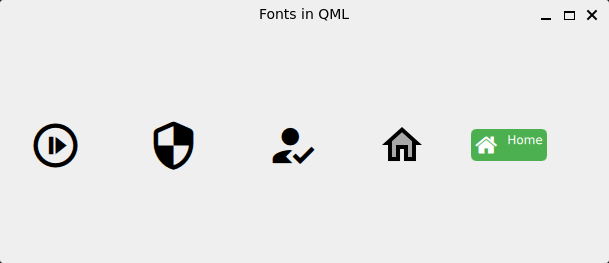

# Qt + QML + Font Awesome/Material Design Icons/Fontello



Get a font file, for example [Material Design Icons](https://github.com/google/material-design-icons/archive/refs/tags/4.0.0.zip), [Fontello](https://fontello.com/) or a font of your choice. Supported formats include `.ttf`, `.otf`, and other TrueType/OpenType formats.

**Add font to resource system:**

```cmake
qt_add_resources(appqml_fonts "qrc_fonts"
    PREFIX "/"
    FILES
        fonts/Fontello-Font-Awesome.ttf
        ...
)
```

**Register font in font database:**

```c++
QList<QString> fonts = {
    ":/fonts/Fontello-Font-Awesome.ttf",
    ...
};

for (const auto& font : fonts)
{
    if (QFontDatabase::addApplicationFont(font) == -1)
    {
        qDebug() << "Failed to load font: " << font;
        return 1;
    }
}
```

**Using in QML:**

```qml
ToolButton  {
    text: "\uf0d1"
    font.family: "Material Icons Outlined"
    font.pointSize: 40
}
```

More usage examples in [Main.qml](Main.qml).

> [!IMPORTANT]  
> Check the font's family name using `QFontDatabase::families()` - this is the name you must use in QML's `font.family` property, which may differ from the filename.

> [!IMPORTANT]  
> Confirm you're using the correct Unicode code (e.g. `\uf0d1`) for selected icon.

**Finding your font family name:**

If unsure about the font family name, you can print all available families:

```c++
for (const auto& family : QFontDatabase::families())
{
    qDebug() << family;
}
```

Look for the family name that matches your font file and use it in QML.

## Font Resources

- [Material Design Icons](https://github.com/google/material-design-icons) - Google's design system icons
- [Fontello](https://fontello.com/) - Custom icon font builder
- [Font Awesome](https://fontawesome.com/) - Popular open-source icon set
- [Google Fonts](https://fonts.google.com/) - Free, open-source typefaces
